# Hable Issue Engineering, At A Glance

This is the simple version of Hable's issue workflow. GitHub Issues are the
active task board. The `Developement/` folder contains the rules and system
documentation that help an agent understand the project before changing it.

## The flow

```mermaid
flowchart LR
    A["User reports a task"] --> B["GitHub issue<br/>label: raw"]
    B --> C["Read issue + repo docs<br/>and inspect connected code"]
    C --> D["Write an engineered plan<br/>in the issue comments"]
    D --> E["GitHub issue<br/>label: engineered"]
    E --> F["Implement only the<br/>smallest safe scope"]
    F --> G["Run focused verification<br/>and update docs if needed"]
    G --> H["Commit the change"]
    H --> I["Post completion note<br/>with commit and checks"]
    I --> J["GitHub issue<br/>label: proceeded"]

    classDef intake fill:#dff4ee,stroke:#24745b,color:#153d31;
    classDef planning fill:#fff1c7,stroke:#a87800,color:#4c3900;
    classDef delivery fill:#e5e9ff,stroke:#4f5fb8,color:#20284f;
    class A,B intake;
    class C,D,E planning;
    class F,G,H,I,J delivery;
```



## What each label means

| Label | Plain-language meaning | What happens next |
| --- | --- | --- |
| `raw` | The request is captured, but its scope is not clear enough to implement safely. | Engineer the issue. |
| `engineered` | The issue has a concrete implementation contract, boundaries, edge cases, and acceptance checks. | Implement and verify it. |
| `proceeded` | The implementation is complete, verified, committed, and reported in the issue. | Leave it closed unless new work appears. |

## The engineered comment

Before implementation, the agent adds one comment that answers:

- What problem are we solving?
- What is the smallest safe change?
- Which files, systems, and tests are involved?
- What is explicitly out of scope?
- What edge cases matter?
- How do we preserve offline-first behavior, privacy, and scalability?
- What observable results prove the work is complete?

The full reusable template lives in
[`ai_agent_contract.md`](ai_agent_contract.md). That contract is the authority
for issue handling; this page is the quick guide for contributors and agents.

## The issue thread is the record

```text
Issue body       = original raw request
Comment 1        = engineered implementation contract
Code + tests     = delivered change
Comment 2        = completion note and verification evidence
Final label      = proceeded
```

For non-trivial work, the agent first gathers context from the relevant source
files and development documents. Graphify is preferred for broad, cross-cutting
questions; direct repository inspection remains the fallback when it is not
available. Important facts are always confirmed against the actual code.

## Good engineering is bounded engineering

An issue should be small enough to verify and clear enough to review. If a
larger architectural improvement is discovered, record it as future split
guidance or a separate raw issue instead of silently expanding the current task.

Scalability is a required check. The engineered comment should identify a
concrete risk—such as database writes, provider rebuilds, sync payload size,
backend query fan-out, or UI-thread work—or state that no meaningful impact is
expected.
