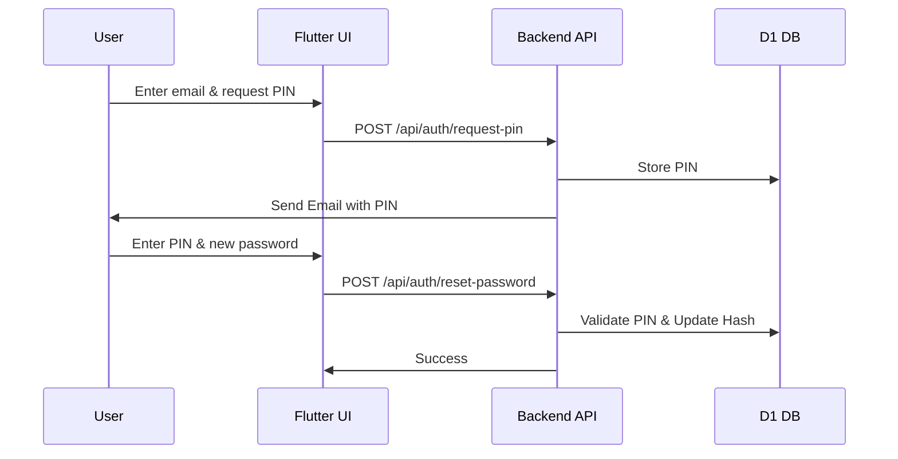
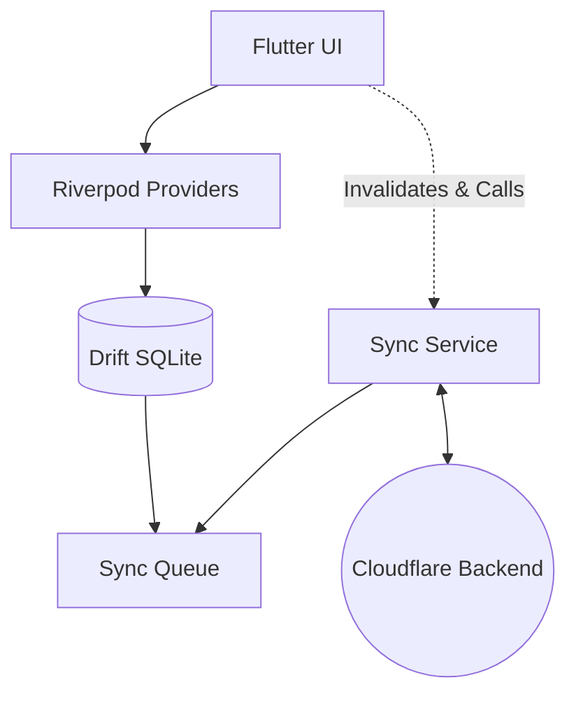
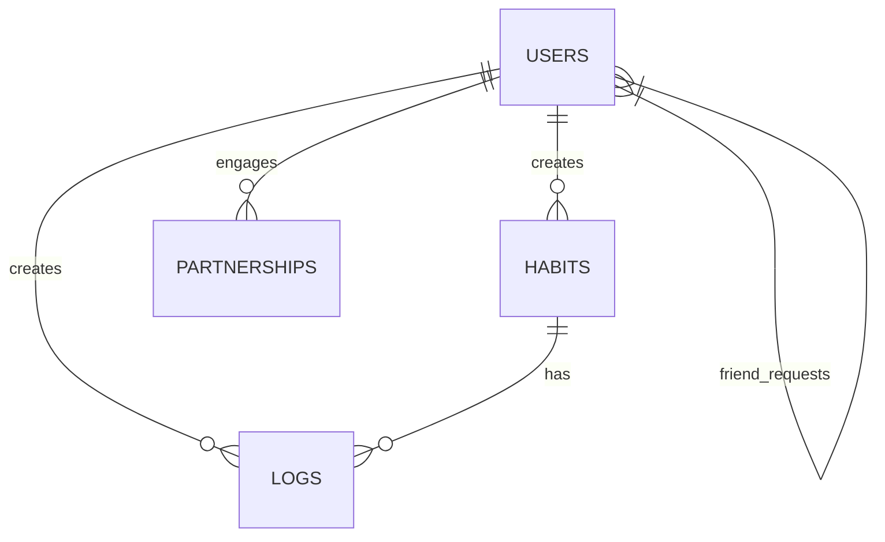
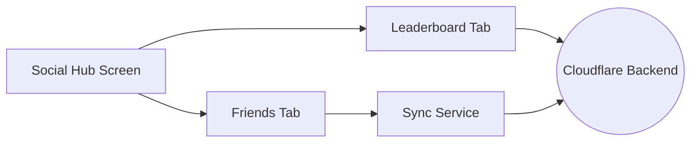
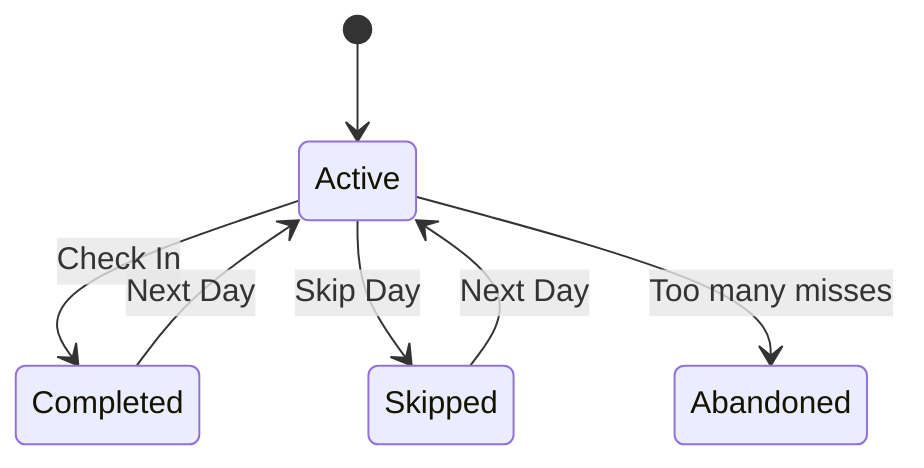
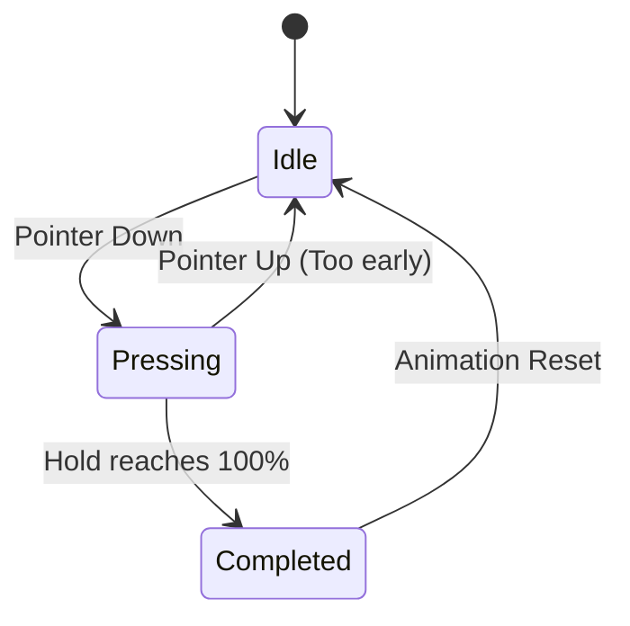

# Hable UML Diagrams

This file combines the Mermaid diagrams from `Developement` into one documented reference.

## Contents

1. Authentication Flow
2. Offline Architecture
3. Schema & Core Logic
4. Social & Analytics
5. Habit States & Scoring
6. Mud Button & Animations

## 1. Authentication Flow

Source: [`sys_authentication.mmd`](sys_authentication.mmd)

Sequence diagram for PIN-based login and password reset.

## 2. Offline Architecture

Source: [`sys_offline_architecture.mmd`](sys_offline_architecture.mmd)

Flowchart for the local-first data path using Riverpod, Drift, sync services, and Cloudflare backend sync.

## 3. Schema & Core Logic

Source: [`sys_schema_and_logic.mmd`](sys_schema_and_logic.mmd)

Relational table summary for the core user, habit, log, and friendship model.

| Table | Primary Key | Foreign Keys | Relationship Notes |
| --- | --- | --- | --- |
| `USERS` | `user_id` | - | One user can create many habits and logs. |
| `HABITS` | `id` | `user_id` → `USERS.user_id` | Each habit belongs to one user. |
| `LOGS` | `id` | `user_id` → `USERS.user_id`, `habit_id` → `HABITS.id` | Each log belongs to one user and one habit. |
| `PARTNERSHIPS` | composite or generated ID | `user_id` → `USERS.user_id`, `partner_id` → `USERS.user_id` | Connects users to shared habit participation. |
| `friend_requests` | request ID | `requester_id` → `USERS.user_id`, `recipient_id` → `USERS.user_id` | Tracks pending or completed friend request relationships. |

## 4. Social & Analytics

Source: [`sys_social_and_analytics.mmd`](sys_social_and_analytics.mmd)

Component flowchart for the social hub, leaderboard, friends tab, and sync service.

## 5. Habit States & Scoring

Source: [`ux_habit_states_and_scoring.mmd`](ux_habit_states_and_scoring.mmd)

State diagram for the habit lifecycle, including check-ins, skips, and abandonment.

## 6. Mud Button & Animations

Source: [`ux_mud_and_animations.mmd`](ux_mud_and_animations.mmd)

State diagram for the long-press mud interaction and its completion/reset flow.

