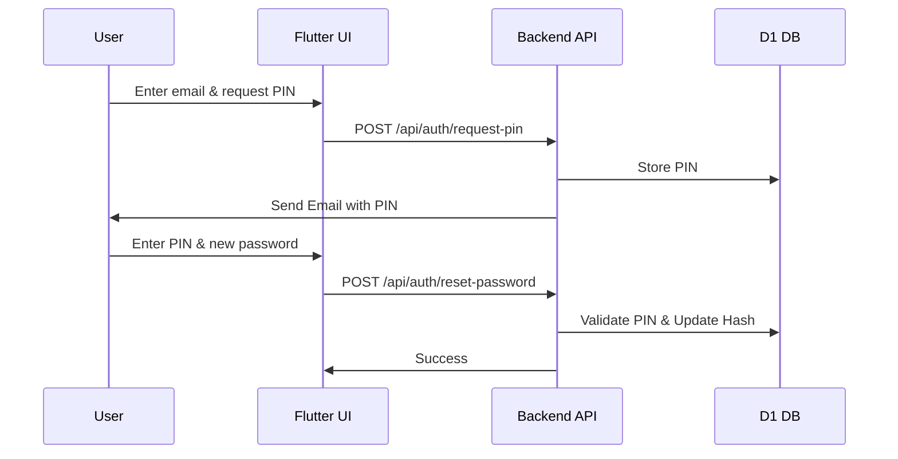
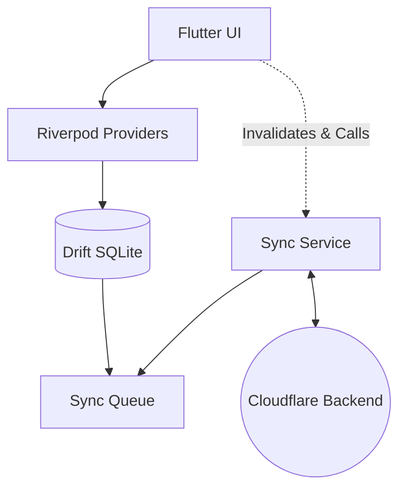
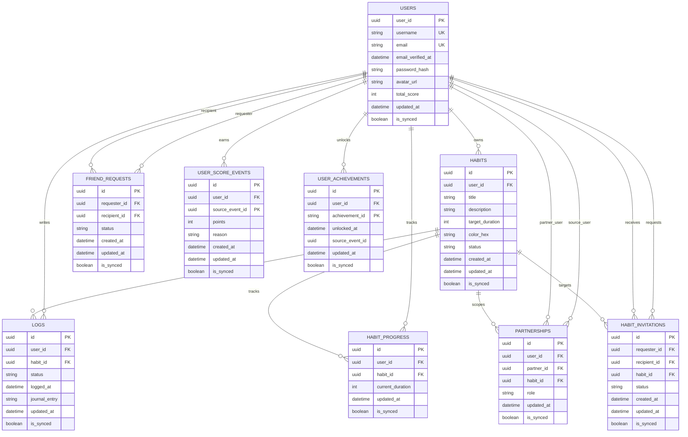
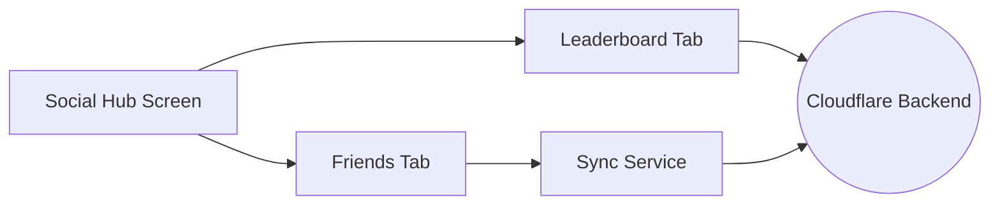
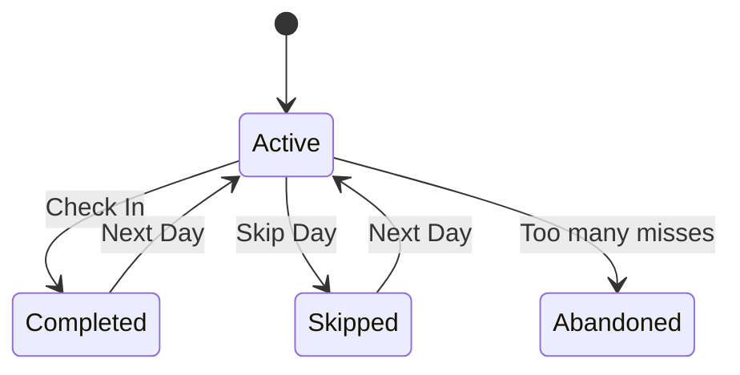
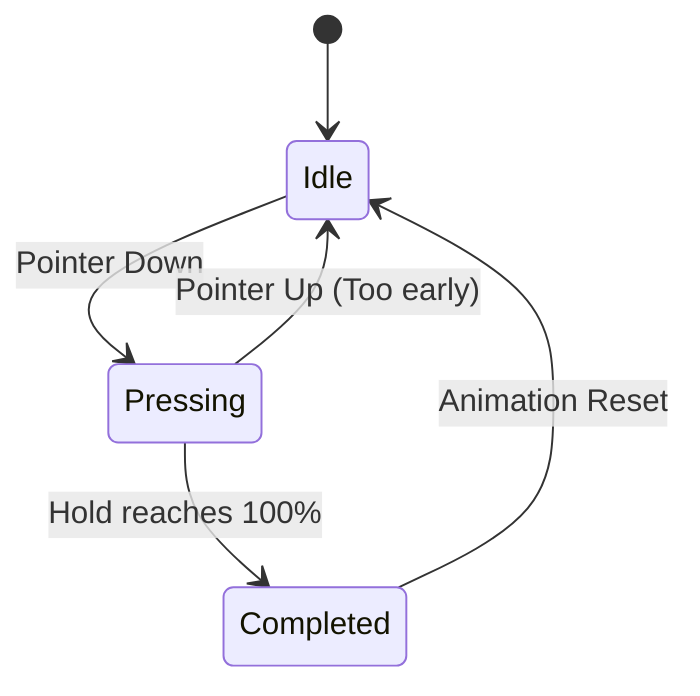

# Hable UML Diagrams

This file combines the Mermaid diagrams from `Developement` into one documented reference.

## Contents

1. Authentication Flow
2. Offline Architecture
3. Schema & Core Logic
4. Social & Analytics
5. Habit States & Scoring
6. Mud Button & Animations

## 1. Authentication Flow

Source: [`sys_authentication.md`](sys_authentication.md)

Sequence diagram for PIN-based login and password reset.

## 2. Offline Architecture

Source: [`sys_offline_architecture.md`](sys_offline_architecture.md)

Flowchart for the local-first data path using Riverpod, Drift, sync services, and Cloudflare backend sync.

## 3. Schema & Core Logic

Source: [`sys_schema_and_logic.md`](sys_schema_and_logic.md)

Advanced relational schema for the core user, habit, log, and friendship model.

## 4. Social & Analytics

Source: [`sys_social_and_analytics.md`](sys_social_and_analytics.md)

Component flowchart for the social hub, leaderboard, friends tab, and sync service.

## 5. Habit States & Scoring

Source: [`ux_habit_states_and_scoring.md`](ux_habit_states_and_scoring.md)

State diagram for the habit lifecycle, including check-ins, skips, and abandonment.

## 6. Mud Button & Animations

Source: [`ux_mud_and_animations.md`](ux_mud_and_animations.md)

State diagram for the long-press mud interaction and its completion/reset flow.

